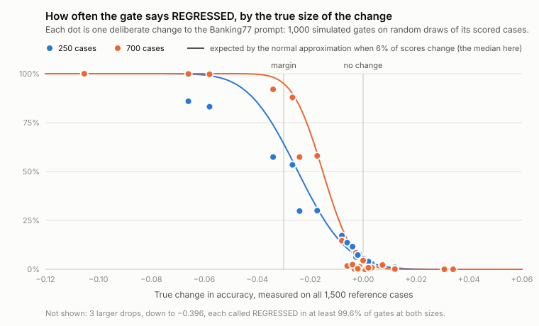

# Tripwire

A statistical regression gate for LLM systems: run the old and the new version of a
prompt or pipeline on the same test cases, and block the change when the new one is
measurably worse.

LLM outputs are samples, not return values. "Accuracy went from 60% to 55%" might be a
real regression or might be noise, and a fixed threshold cannot tell the difference.
Tripwire treats an eval as a paired experiment and reports the difference with a
confidence interval and one of four verdicts.

Everything runs locally against open models through [Ollama](https://ollama.com). No API
key is needed.

## What a blocked change looks like

Removing the few-shot examples from the Banking77 prompt, gated against the previous
commit (`tripwire gate banking-intent --base HEAD`, 700 cases, `gemma3:4b`; output abridged):

```text
Tripwire: REGRESSED · banking-intent        This blocks the merge.

| metric     | base  | head  | Δ      | 95% interval     | p      |
| exact.pass | 0.596 | 0.550 | -0.046 | [-0.071, -0.021] | 0.0010 |

margin 0.030 · α 0.025 · paired on 700 of 700 cases · McNemar p 0.0007
Stage 2 of 2: the first-stage subset could not decide, so every case was run.

Guardrails   output tokens 0.930 (limit 1.25) ok · latency p95 1.272 (limit 1.5) ok
Flips        59 broke · 27 fixed · 358 stable pass · 256 stable fail

Broke (top 10 of 59)
| input                                        | expected          | base said         | head said             |
| What's the process for topping up by card?   | topping_up_by_card| topping_up_by_card| top_up_by_card        |
| I cannot get my google pay to work.          | apple_pay_or_...  | apple_pay_or_...  | contactless_not_working|
```

The second run of the same command makes zero model calls: every sample is cached.

## Verdicts

The candidate has to show it is *not worse than the baseline by more than a margin you
chose in advance*. With too little data the answer is `INCONCLUSIVE`, never a silent pass.

| Verdict | Meaning | Exit code |
|---|---|---|
| `IMPROVED` | confidently better | 0 |
| `PASS` | any drop is confidently smaller than the margin | 0 |
| `UNCHANGED` | nothing that affects the output changed; no model is called | 0 |
| `REGRESSED` | confidently worse, possibly beyond the margin | 1 |
| `INCONCLUSIVE` | cannot tell "fine" from "too much worse" | 2 (configurable) |
| `INVALID` | too many cases failed to produce a scorable answer | 3 |

A guardrail over its limit or a slice that regressed significantly also blocks, with exit
code 1. The method is described in [docs/methodology.md](docs/methodology.md).

## How good is the gate?

A gate that blocks merges has to be tested itself. Twenty-eight deliberate changes to the
Banking77 setup (edits meant to hurt, edits meant to change nothing, two other models)
were each run on 1,500 cases to get their real effect, and the gate was then replayed a
thousand times per change on random draws of those cases.



| Margin 3 points, alpha 5% | 250 cases | 700 cases | Staged 250 → 700 |
|---|---|---|---|
| Drop beyond the margin (7 changes): called `REGRESSED` | 89% | 99% | 98% |
| The same: let through | 1% | 0% | 1% |
| No effect (27 changes, sides swapped at random): called `REGRESSED` | 4% | 3% | 4% |
| No drop (10 changes): passed | 78% | 95% | 93% |

- The staged gate ran 38 to 55% fewer cases than one look at 700.
- A plain threshold on the same draws: "any drop" blocked 23 to 26% of the changes that
  did nothing; "a drop over the margin" let through 6 to 8% of the real regressions.
- Shuffling the label list, meant to be harmless, raised accuracy by 3.1 points. A prompt
  too long for its context window lost 26.4 points with no error from the runtime, and
  was called `REGRESSED` in over 99% of gates.

The method, the limits and what stopping early costs are in
[docs/benchmark.md](docs/benchmark.md); every table is in
[experiments/reports/proof.md](experiments/reports/proof.md) and regenerates with
`python experiments/proof.py`.

## Status

| Piece | State |
|---|---|
| Datasets: content-hashed cases, versioning, lint, stratified splits | done |
| Runner: resumable, seeded, cached samples; Ollama and OpenAI-compatible backends | done |
| Scorers, eval self-check, single-run report | done |
| Paired comparison, verdicts, slices, guardrails, power analysis, A/A calibration | done |
| Gate against a git ref, sample bundles, CI workflow with a pull-request comment | done |
| LLM judge: versioned verdicts, probes with known answers, blind labelling, calibration | done |
| Growing datasets: perturbations, model-drafted cases, TraceLens import, human review | done |
| Two-stage gate, run queue, usage report | done |
| Bisect, drift canary, HTML reports, dashboard | done |
| Benchmark of the gate itself on seeded regressions | done |

## Quick start

Requires Python 3.12+ and Ollama with `gemma3:4b` pulled.

```bash
git clone https://github.com/athacoder/tripwire.git
cd tripwire
python -m venv .venv
source .venv/bin/activate        # Windows: .venv\Scripts\activate
pip install -e ".[dev]"

tripwire doctor                          # is the model reachable and on the GPU?
tripwire selfcheck banking-intent        # is the eval itself sound?
tripwire run banking-intent              # generate and score every missing sample
tripwire report banking-intent           # score with an interval, slices, worst cases
tripwire compare banking-intent banking-intent-zero-shot
```

The tests need neither Ollama nor a GPU:

```bash
pytest -q
```

## Gating a change

Edit a prompt or a target, then:

```bash
tripwire gate banking-intent --base origin/main            # runs both sides, prints the verdict
tripwire gate banking-intent --base origin/main --bundle   # also writes bundles/ to commit
```

`--base` is any git ref. Tripwire reads the prompt and target files as they were at that
ref, runs that old target on today's cases, and compares it with the working tree.

CI runners have no GPU, so the gate is split. `--bundle` writes the samples for both sides
as small gzip files under `bundles/`; commit them with the change. The
[gate workflow](.github/workflows/gate.yml) then runs `tripwire gate --verify-only`, which
recomputes each side's key from the files in the pull request, loads the matching bundles,
redoes the scoring and the statistics, and comments on the pull request. It never calls a
model and needs no secrets. A bundle made for an older prompt cannot stand in for a changed
one, because the key is computed from the prompt itself.

What this trusts: that the committed samples really came from the stated model on the
author's machine. That is fine for a solo project and worth knowing for a team.

## Commands

| Command | What it does |
|---|---|
| `tripwire doctor` | Checks each suite's model is pulled, loads, and how much of it is on the GPU |
| `tripwire bench SUITE` | Times a few cases and projects the duration of every split |
| `tripwire run SUITE` | Generates and scores missing samples. `--limit`, `--max-minutes`, `--dry-run` |
| `tripwire score SUITE` | Re-scores stored samples after a scorer change. Calls no model |
| `tripwire selfcheck SUITE` | Reference answers must pass and junk answers must fail |
| `tripwire report SUITE` | Score with an interval, slices, variance split, lowest-scoring cases |
| `tripwire compare BASE HEAD` | Paired comparison of two suites that share a dataset |
| `tripwire gate SUITE --base REF` | Compares the working tree (or `--head REF`) against a git ref |
| `tripwire bisect SUITE --good REF` | Finds the first commit at which the gate blocks a suite, without touching the working tree |
| `tripwire canary SUITE` | Reruns a fixed subset afresh against a pinned earlier run: has the model moved underneath? |
| `tripwire dashboard` | History, comparisons, flipped cases, speed against quality, judge, labelling and power, in the browser |
| `tripwire power SUITE` | Cases needed for a given drop, by formula and by simulation |
| `tripwire aa SUITE` | Compares a suite with itself to measure the false-alarm rate |
| `tripwire queue [SUITES]` | Runs suites back to back, one model at a time, within a time budget |
| `tripwire usage` | Model calls, tokens and model time by day, and what the cache saved |
| `tripwire judge run SUITE` | Judges stored answers that have no verdict yet. Resumable |
| `tripwire judge probe SUITE --probes FILE` | Tests the judge on answers built to be right or wrong in known ways |
| `tripwire label SUITE` | Blind hand-labelling of stored answers |
| `tripwire judge calibrate SUITE` | Judge against human labels and against a rule-based check |
| `tripwire dataset lint FILE` | Duplicates, conflicting labels, empty fields, leakage into prompts |
| `tripwire dataset split SRC OUT --size dev=200 ...` | Disjoint stratified splits |
| `tripwire dataset perturb SRC OUT` | Adds variants whose answer must not change: a robustness set |
| `tripwire dataset gen DATASET SEED OUT --model M` | A model drafts candidate cases; a second call screens them |
| `tripwire dataset import-tracelens OUT` | Failures diagnosed by TraceLens become candidate cases |
| `tripwire dataset review CANDIDATES --into DATASET` | Approve, correct or reject candidates by hand |

Suites live in `tripwire.toml`; each names a dataset, a target file, its scorers, the
primary metric, the margin and optional guardrails. `report`, `compare`, `gate` and
`canary` take `--out FILE`; a name ending in `.html` gets one self-contained page.

What to do after a verdict (find the commit, check for drift, look at the answers) is in
[docs/investigating.md](docs/investigating.md).

## How it works

A **case** is one test item, identified by a hash of its input and expected answer. A
**target** is the system under test: a prompt and a model, a Python function, or an HTTP
endpoint. Its **fingerprint** is a hash of everything that can change its output: the
model's digest, the exact prompt text, sampling parameters, context size, and any source
files it declares.

A **sample** is one output, stored under `(fingerprint, case, repetition)`. That one key
gives caching, resume and baseline lookup for free: an unchanged target never calls the
model twice, an interrupted run picks up where it stopped, and "the baseline" is simply
the fingerprint of the target at the base ref.

Each sample's seed is derived from the case and the repetition, so repetitions are
distinct draws and a whole run can be regenerated. Deleting 50 stored samples and
generating them again reproduced all 50 outputs on the reference machine.

Failed requests are never scored. A timeout, an HTTP error or a crash inside a target goes
to an `errors` table, a cut-off answer is stored as `truncated`, and neither is confused
with a wrong answer. Before a run or a judging pass starts, Tripwire checks that the
longest prompt fits the context window, because Ollama cuts a prompt that does not fit and
answers anyway: given 2,308 tokens for a 2,048-token window, it kept 1,027 and said nothing.

**Scores** carry the scorer's version. Changing a scorer adds rows instead of rewriting
history, and re-scoring stored outputs costs nothing.

## Measured on the reference machine

RTX 3050 laptop GPU (6 GB), `gemma3:4b`, Banking77 gate split (700 cases).

| | |
|---|---|
| Speed | 0.29 s per case; the 700-case gate split runs in under four minutes |
| Baseline | `exact.pass` 0.596, 90% interval [0.564, 0.626] |
| Rerun noise | 1.9% of cases change between two repetitions |
| Where the variance is | 96% between cases, 4% within: add cases, not repetitions |
| A/A false-alarm rate | 4.4% over 500 self-comparisons (nominal ceiling 10%) |
| Few-shot examples removed | Δ −0.046 [−0.067, −0.024], `REGRESSED` |

| Two-stage gate | a whitespace-only prompt edit passed on 250 of 700 cases |
| Prompt layout | sharing the prompt prefix between cases makes a run 2.7 times faster |

These describe one model on one dataset. Throughput and the two-stage
gate are covered in [docs/running-at-scale.md](docs/running-at-scale.md).

## Judged metrics

When no rule can score an answer, a local model judges it: one criterion per call,
evidence quoted before the verdict, the answer treated as untrusted text. The judge is
measured before it is believed ([docs/judge.md](docs/judge.md)):

| Check (judge `qwen2.5:7b`, answers from `gemma3:4b`) | Result |
|---|---|
| Held-out probes: answers built to be right or wrong in ten known ways | `correct` κ 0.95, `grounded` κ 1.00 |
| Agreement with an independent rule on 240 real answers | 99.2%, κ 0.95 |
| Verdicts that change under a reworded rubric | 2.8% and 2.7% |
| Known weakness | passes an answer that denies a policy exists when the documents are silent |

Getting there took eight attempts at the rubric. What worked was judging one sentence at a
time, switching judge model, and letting a rule decide which sentences make a claim at
all, not more careful wording.

A judged regression, caught with slices: dropping the "say so if the documents do not
cover it" instruction took `judge.correct` from 0.904 to 0.775 (Δ −0.129, interval
[−0.171, −0.092]). Answerable questions did not move; unanswerable ones fell by more than
half.

No human labels have been collected yet. `tripwire label` and `tripwire judge calibrate`
are ready for them.

## Robustness and growing a dataset

`tripwire dataset perturb` adds variants of each case whose answer must not change, and
reports pair every variant with its original. On Banking77 no perturbation moved the
average score detectably, yet 7–10% of individual answers changed under a typo, lower
case or an irrelevant extra sentence, against 1.9% from simply re-running the prompt.

New cases can also be drafted by a model or imported from failures that
[TraceLens](https://github.com/athacoder/tracelens) diagnosed. Both produce candidates
only; nothing enters a dataset until a person approves it, and a model is never scored
against cases it drafted. See [docs/growing-datasets.md](docs/growing-datasets.md).

## Other backends

Ollama on `localhost` is the default. Anything that speaks the OpenAI chat API also
works: LM Studio, llama.cpp's server, vLLM, or a hosted API. Add a provider block to
`tripwire.toml` and name it in the target file:

```toml
[provider.lmstudio]
kind     = "openai_compat"
base_url = "http://localhost:1234/v1"

[provider.groq]
kind        = "openai_compat"
base_url    = "https://api.groq.com/openai/v1"
api_key_env = "GROQ_API_KEY"   # the variable's name; the key itself is never stored
```

## Datasets

- [`datasets/banking77`](datasets/banking77/README.md): three splits of Banking77
  (customer-service intent classification, 77 intents, CC BY 4.0).
- [`datasets/policy_qa`](datasets/policy_qa/README.md): 240 questions about templated
  policy documents, a quarter of them deliberately unanswerable, plus probe answers for
  testing a judge. Scored by an LLM judge and, independently, by a rule.
- [`datasets/invoices`](datasets/invoices/README.md): 300 synthetic invoices for
  structured extraction. Expected answers are built from the same parameters that render
  each invoice, so no model or annotator produced them.

## Layout

```text
src/tripwire/   models, datasets, generate, providers, targets, runner, scorers,
                judge, stats, compare, report, gate, store, cli
datasets/       JSONL cases and dataset cards
prompts/        system and user prompts, versioned in git
targets/        one file per system under test
scripts/        dataset importers and generators
tests/          run on a deterministic mock provider
experiments/    the benchmark of the gate: its variants, the replay, the reports
docs/           methodology, the benchmark, the judge, growing datasets, running at
                scale, investigating, design notes
```

## License

MIT. The Banking77 data is redistributed under CC BY 4.0; see its dataset card.
